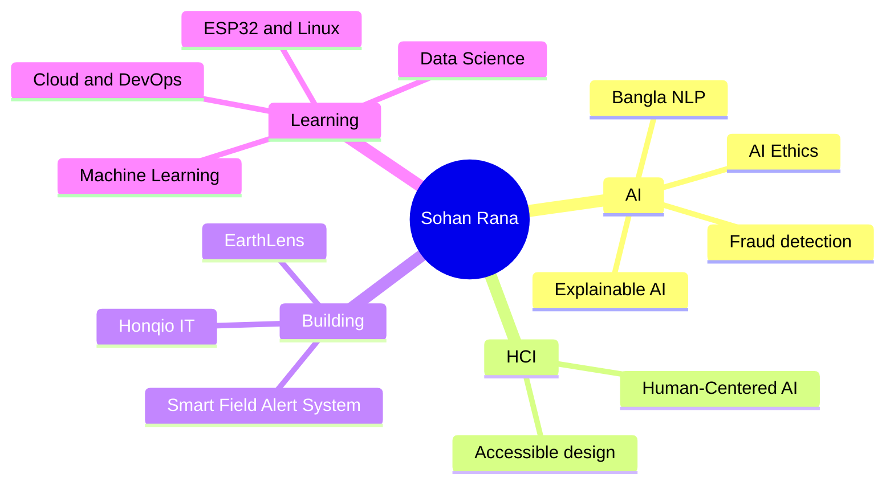
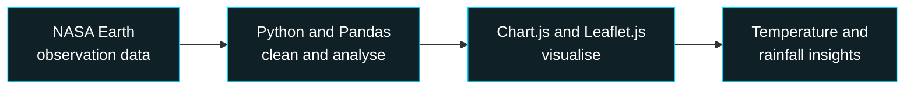
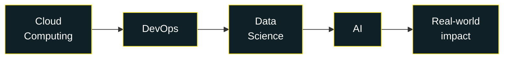
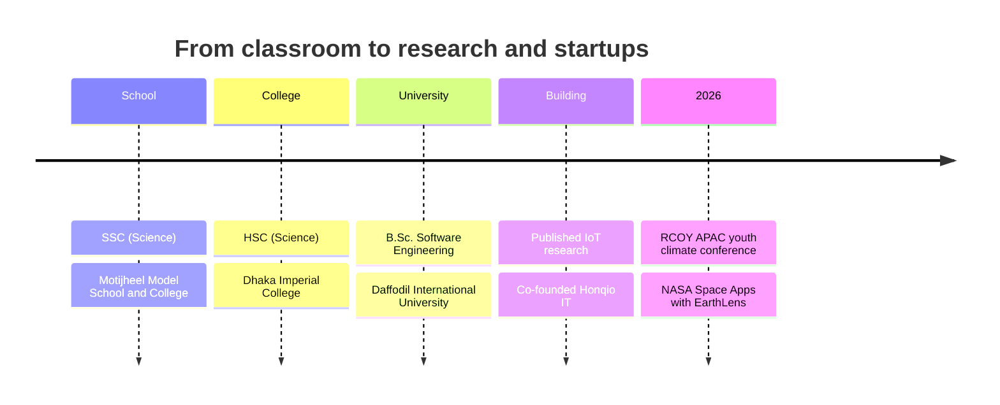

📍 Dhaka, Bangladesh &nbsp;|&nbsp; [Portfolio](https://sohan-rana.github.io/SOHAN/) &nbsp;|&nbsp; [LinkedIn](https://www.linkedin.com/in/sohan-r-54729a184/) &nbsp;|&nbsp; [Email](mailto:sohanrana243@gmail.com) &nbsp;|&nbsp; [Google Scholar](https://scholar.google.com/citations?user=706NRN8AAAAJ&hl=en) &nbsp;|&nbsp; [ResearchGate](https://www.researchgate.net/profile/Md-Sohan-Rana)

> [!TIP]
> **Open to** internships, research collaboration, and AI / NLP / HCI / data science projects. Say hello at **sohanrana243@gmail.com**.

---

## 👋 Who I am

I build and study intelligent systems with one question in mind: **who does this technology actually help?** My work sits where Artificial Intelligence, Human-Computer Interaction and Natural Language Processing meet real human needs, with a focus on systems that are useful, accessible and ethical.

I started with software development and practical problem-solving, then moved toward research-driven, human-centered AI. I have **published research** on an Arduino-based agricultural intrusion detection system, and I am working on fraud detection for Bangla job advertisements. I am also **Co-founder & COO of Honqio IT**, a startup in Cloud Computing, AI, DevOps and Data Science.

| | |
|:--|:--|
| 🎓 **Education** | B.Sc. Software Engineering, Daffodil International University |
| 🏢 **Role** | Co-founder & COO, Honqio IT |
| 🔬 **Research** | HCI · AI Ethics · Bangla NLP · Human-Centered AI |
| 🗣️ **Languages** | Bangla (native), English (intermediate-advanced) |
| 🧭 **Mission** | Build technology that is innovative, responsible, inclusive and human-centered |

---

## 🧠 My world at a glance

---

## 🚀 Now

| Focus | Details |
|:--|:--|
| **Project** | BanglaJobGuard: explainable hybrid AI for detecting fraudulent job ads in Bangladesh |
| **Competition** | NASA Space Apps Challenge 2026, EarthLens (Team Cosmic Mindshift, 14-15 Nov 2026) |
| **Startup** | Building Honqio IT |
| **Learning** | Machine Learning, NLP, Data Science, AWS / Azure / Google Cloud, DevOps, Docker, Linux, ESP32 |

---

## 🔥 Featured work

### 🛡️ BanglaJobGuard

Explainable hybrid AI that flags fraudulent and suspicious job ads in the Bangla job market. IEEE-format paper, with a rule-based public MVP live and NLP/ML models planned next.

`Python` `NLP` `Explainable AI`

### 🌍 EarthLens (NASA Space Apps Challenge 2026)

Bangladesh Environmental Trend Detective: turns NASA Earth observation data into accessible visual insights about temperature and rainfall trends.

`Python` `Pandas` `Chart.js` `Leaflet.js`

### 🌾 Smart Field Alert System (published)

Low-cost Arduino-based intrusion detection for farmland using a PIR HC-SR501 sensor. Published on [ResearchGate](https://www.researchgate.net/publication/404114451_Smart_Field_Alert_System_Using_Arduino_for_Agricultural_Intrusion_Detection).

`Arduino` `IoT` `Sensors`

<b>More projects</b>

- **Honqio IT website**: `HTML` `CSS` `JavaScript` `Netlify`
- **DIU Bus Service Automation**: `React` `Node.js` `MySQL`
- **Real Estate Management System**: `MySQL` `XAMPP`
- **Blood Donation & Emergency Matching App**: capstone concept

---

## 🏢 Honqio IT

**Co-founder & COO.** A technology startup delivering practical digital solutions for individuals and organizations. Website: [honqioit.netlify.app](https://honqioit.netlify.app)

*Your partner in progress.*

---

## 🧭 Journey

<b>Conferences, forums and engagements</b>

- **RCOY APAC 2026**: youth climate conference participant
- **NASA Space Apps Challenge 2026**: Team Cosmic Mindshift (EarthLens)
- Youth forums, workshops, volunteering and collaborative initiatives on technology, climate and society

---

## 🛠️ Tech stack

**Learning now**

---

## 📊 GitHub

<picture>
  <source media="(prefers-color-scheme: dark)" srcset="https://github-readme-stats.vercel.app/api?username=Sohan-Rana&show_icons=true&theme=tokyonight&hide_border=true&rank_icon=github">
  
</picture>
<picture>
  <source media="(prefers-color-scheme: dark)" srcset="https://github-readme-stats.vercel.app/api/top-langs/?username=Sohan-Rana&layout=compact&theme=tokyonight&hide_border=true">
  
</picture>

<picture>
  <source media="(prefers-color-scheme: dark)" srcset="https://streak-stats.demolab.com?user=Sohan-Rana&theme=tokyonight&hide_border=true">
  
</picture>

<picture>
  <source media="(prefers-color-scheme: dark)" srcset="https://github-readme-activity-graph.vercel.app/graph?username=Sohan-Rana&theme=tokyo-night&hide_border=true&area=true">
  
</picture>

---

## 🌱 Beyond code

Reading, storytelling, podcasts, and youth-led climate and community initiatives. I believe good technology starts with understanding people and their problems.

